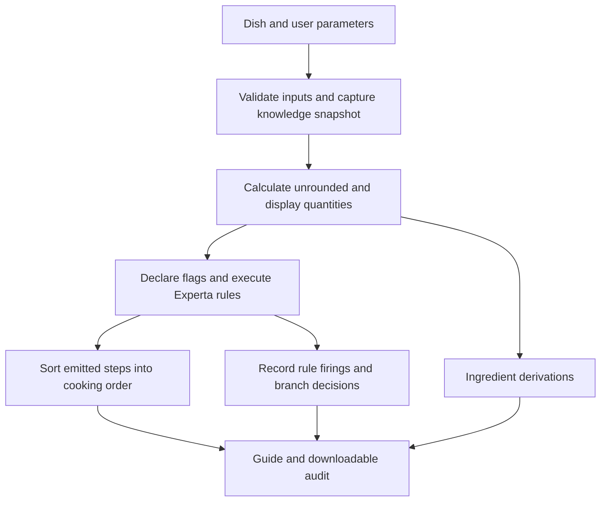

# Implementation and results of ExpertCook

This chapter describes the implementation and software evaluation of ExpertCook, a rule-based cooking advisory system for Nigerian jollof rice and fried rice. The work addressed two implementation concerns: preserving the relationship between rice quantity and ingredient quantities, and explaining when and why procedural rules execute. The resulting system separates unrounded calculations from practical display quantities and attaches execution evidence to each generated cooking step.

The reported evaluation concerns software behavior. It does not establish the culinary accuracy of the recipe ratios, the sensory quality of prepared meals, user satisfaction or food-safety outcomes. Results were collected locally on 14 September 2026. Public deployment is a subsequent activity, for which deployment files and instructions have been prepared.

## 1 Implementation context

The repository contained two branches. `main` represented the earlier implementation, while `proportions` added an editable JSON knowledge base and a Flask web interface. The changes described here were implemented on `proportions`, starting from commit `a15fb1e03fde381ce669be84ca0c68019cf907d5`.

The existing system already derived ingredient quantities from rice and generated recipe steps with Experta. However, the original output did not retain the calculation before rounding or identify the rule execution responsible for each step. The planner also read the configuration several times during a request. A concurrent edit could therefore change the source data between calculations. The save endpoint temporarily activated a candidate file before validating it, creating an additional consistency problem.

Inspection identified two concrete calculation defects. First, minimum rounding increments could turn zero into a positive ingredient quantity. Second, frying batch counts used a rounded cooked-rice estimate, which could hide a small but real capacity excess. Some cooking instructions also hard-coded ingredient units even though the ingredient table used editable units from the knowledge base.

## 2 System architecture

The implementation retains a shared Python entry point, `build_plan`, used by the web, command-line and desktop interfaces. The browser sends the selected dish and user parameters to Flask. The planner validates these inputs, obtains one knowledge snapshot, calculates quantities and invokes the appropriate recipe engine. The engine emits Step facts, which are sorted into cooking order. The web response combines the ordered instructions with ingredient derivations and execution evidence.



Figure 1 shows the implemented request flow. The audit is collected during execution and then attached to the result. It is not reconstructed from the final order of the cooking instructions.

| Component | Implemented responsibility |
|---|---|
| `recipes.py` | Dish metadata, supported parameters and defaults |
| `proportions.py` | Knowledge validation, request snapshots and atomic saves |
| `scaling.py` | Decimal-based multiplication, display rounding and batch counts |
| `facts.py` and `engines.py` | Fact types and recipe-specific procedural knowledge |
| `audit.py` | Rule execution evidence and implementation identity |
| `planner.py` | Coordination and construction of the returned plan |
| `server.py` and `static/index.html` | HTTP API, explanations and evidence download |

## 3 Knowledge representation and proportionality

Ingredient relationships are stored in `proportions.json`. Each dish defines its own ingredients, rice-type liquid ratios, expansion estimates and reserve-liquid ratio. A standard ingredient record contains a label, amount per cup of rice, unit and display-rounding mode. Spice ingredients select their ratio from the chosen spice level. Liquid uses the selected rice type's ratio. Protein is set to zero when the user selects no protein. To-taste ingredients have no fixed numeric amount.

For a standard ingredient, the unrounded amount is the input rice quantity multiplied by that ingredient's ratio. A separate rounding function converts this amount to a practical displayed measurement. The implementation stores both values. Consequently, a reader can distinguish the proportional model from the measurement recommendation shown to the cook.

For example, the jollof tomato ratio is 1.33 medium tomatoes per cup of rice. An input of three cups produces an unrounded amount of 3.99 and a displayed amount of four. The current fried-rice carrot ratio is 0.10 stick per cup. Two cups produce 0.20 stick, displayed as one quarter stick. These are the repository's configured relationships; they were not experimentally calibrated during this work.

All rounding modes preserve zero. For positive quantities, the existing minimum increments remain in effect: whole items, halves, quarters or 50-gram increments, depending on the rule. Thus, displayed quantities may be identical for different small rice quantities even when the unrounded amounts differ. This is an explicit limitation of practical measurement rounding, not evidence that the unrounded proportional calculation is identical.

Capacity is evaluated separately. The cooked-rice estimate is obtained from the raw rice quantity and the configured expansion ratio. The number of frying batches is the ceiling of the unrounded estimate divided by the pan capacity. Jollof pot batches use raw rice and pot capacity. Decimal multiplication and ceiling division reduce avoidable errors at decimal boundaries; exported quantities are ordinary JSON numbers, so the system does not claim arbitrary-precision arithmetic throughout.

## 4 Rule execution and explanations

The planner derives flags from validated inputs, including `ready`, `protein_present` or `protein_none`, and a jollof style flag. Procedural rules match these facts. Each rule also uses an absent-Step guard so it does not repeatedly produce the same cooking step.

The party finish rule, for example, requires the party-style flag and the absence of a Step with order 100. When Experta invokes this rule, the audit records the rule identifier, firing sequence, UTC time, matching fact identifier and the successful absence condition. After execution, the event records the emitted Step. This links an observed execution to an output that can be inspected in the guide.

Firing order and cooking order serve different purposes. In the archived jollof party example, `JollofRiceEngine.finish_party` is the first recorded firing, while its output has cooking order 100. The planner still places preparation and cooking steps before the finish. The execution sequence therefore explains the inference process without changing the intended recipe sequence.

Some choices occur inside a rule body rather than in the rule's matching conditions. The batching note is one example. These choices are recorded at the branch that controls the output, with the expression, input values and boolean result. A jollof request for 12 cups with a ten-cup pot records two pot batches and a true result for `pot_batches > 1`.

Non-fired rules receive final-state condition explanations. A vegetarian regular-style jollof request does not fire the protein-cooking rule or the party finish rule. Their required positive flags are absent. These explanations are labelled as end-of-run evaluations because they are not a complete history of agenda activations and retractions.

The current audit serializer supports the literal Flag patterns and absent-Step guards used by these engines. More complex rule patterns would require corresponding extensions to the serializer and tests. The system also does not collect cooking observations: generating an instruction about hard or wet rice is not equivalent to detecting that condition in a real meal.

## 5 Configuration consistency and reproduction

Each request retains one validated knowledge snapshot. The snapshot is used for every ingredient and planning calculation and is included in the returned audit. A canonical JSON representation is hashed with SHA-256 to identify the configuration. A separate implementation hash identifies the relevant Python source files. The audit additionally records a run identifier, input-derived facts and Python/inference-library versions.

Configuration updates are validated before publication. The application writes a unique temporary file in the destination directory, flushes it and atomically replaces the active file. Invalid candidates and simulated replacement failures leave the preceding file unchanged. Concurrent valid edits use the last completed write; the current implementation does not merge changes from multiple editors.

Users can download the complete guide and evidence as JSON. The replay utility checks the archived configuration and implementation identifiers, regenerates the guide with the stored snapshot, and compares ingredients and cooking instructions. It excludes new run IDs, timestamps and firing sequence numbers from that comparison. The stored fried-rice boundary example replayed successfully, matching 16 ingredient records and 14 cooking steps.

These records support inspection and reproduction when the matching source and dependencies are retained. They are not signed records, and the server does not preserve a permanent archive of every request. An implementation hash identifies code but does not replace a source-code archive.

The explanation interface standardizes ingredient derivations, fired rules, non-fired rules and the guide summary into Rule, Inputs, Explanation, Result and Execution fields. It translates condition records into readable requirements while retaining the original JSON under Technical details. Dates are formatted in the viewer's local time zone. Five additional JavaScript tests cover the common field structure, condition and batching explanations, special ingredient cases, safe text escaping and script loading. These are presentation tests, separate from the 36 Python tests and 648-case inference matrix reported below.

## 6 Deployment implementation

The application is packaged in a Docker image based on Python 3.12. The image installs the pinned requirements and runs a dependency-consistency check during the build. Gunicorn serves Flask using one synchronous worker. A process-local lock also serializes engine creation and execution because Experta 1.9.4 rule descriptors retain their bound engine instance.

The editable knowledge file can be placed on a persistent volume through `PROPORTIONS_PATH`. An empty configured location is seeded on startup, while subsequent restarts preserve existing values. Rule saves require an administrator Bearer token unless the explicit local-only override is enabled. The public guide-generation interface does not require that token. A health endpoint verifies that the active knowledge base can be read and validated.

Railway is the recommended host for this small demonstration: one Docker service, one volume and a configured administrator secret. The repository includes `railway.json`, Docker Compose configuration and a separate [deployment guide](DEPLOYMENT.md). Railway supports [Dockerfile builds](https://docs.railway.com/builds/dockerfiles) and [persistent volumes](https://docs.railway.com/volumes). This is a deployment recommendation; no public Railway deployment was performed during the reported evaluation.

## 7 Evaluation method

The primary evaluation was executed with Python 3.12.1 on Linux, Experta 1.9.4, frozendict 1.2, Flask 3.1.3 and Gunicorn 23.0.0. The recorded [verification report](evidence/verification.json) contains the environment, configuration hash, implementation hash, base commit and execution time. The report represents modified working-tree code identified by its implementation hash; the base commit alone does not contain these changes.

The evaluation combined 17 existing core checks with 19 new regression and integration tests. The existing carrot assertion was corrected to match the current knowledge base rather than the older half-cup expectation. New tests covered zero preservation, unrounded scaling, capacity boundaries, unit consistency, malformed inputs and configuration, trace-to-step linkage, branch explanations, archived replay, concurrent engine calls, protected saves, storage initialization and atomic replacement failures. Mutation tests operated on temporary files rather than the active repository configuration.

A separate matrix evaluated every supported categorical input combination at three rice quantities, 0.5, 2.01 and 12 cups, and two equipment capacities, 1 and 6 cups. Jollof contributed 432 cases: three rice types, two styles, three spice levels, four protein options, three rice quantities and two capacities. Fried rice contributed 216 cases using the same dimensions without style. The matrix checked expected step counts, uniqueness of cooking order, satisfied firing conditions, emitted outputs and configuration identity.

The matrix is exhaustive across these selected dimensions only. It does not cover all possible numeric rice quantities, all editable knowledge bases or arbitrary future rules. No line-coverage percentage is inferred from the number of cases.

## 8 Results

| Evaluation | Observed result |
|---|---|
| Core and regression/integration tests | 36 run; zero failures and zero errors |
| Jollof matrix | 432 successful cases |
| Fried-rice matrix | 216 successful cases |
| Combined matrix | 648 of 648 cases passed |
| Rule firings checked in the matrix | 7,614, with outputs and satisfied conditions |
| Archived fried-rice guide replay | 16 ingredient records and 14 cooking steps matched |
| Fresh native dependency check | No broken requirements |
| Docker image build and startup | Successful; Compose reported the service healthy |
| Container dependency check | No broken requirements |
| HTTP smoke checks against the container | Both dishes passed; unknown dish rejected |

The Docker smoke check returned 11 steps and 11 firing events for the three-cup jollof request, and 14 steps and 14 events for the three-cup fried-rice request. It also checked readiness, dish metadata and access to the knowledge base. It did not modify the active configuration.

| Representative condition | Earlier behavior from source inspection | Implemented and tested behavior |
|---|---|---|
| Zero ingredient ratio | Minimum rounding could produce a positive quantity | Unrounded and displayed amounts remain zero |
| 2.01 cups of rice, expansion 3, pan capacity 6 | Rounded volume of 6 used to return one batch | Unrounded volume of 6.03 returns two batches |
| Carrots measured in sticks | Some instructions hard-coded cups | Table and instructions use the configured unit |
| Rule-generated step | Only phase, order and text returned | Step links to an actual firing event and its conditions |
| Configuration edited during a request | Multiple file reads could use different versions | One retained snapshot drives the complete plan |

The before-and-after column documents specific code-path defects and their regression cases. It is not a controlled experiment measuring performance improvement or user outcomes.

The primary verification run took 21.963 seconds, including tests, matrix generation and evidence export. This is an execution duration for one local run, not a latency benchmark or a prediction of public-server throughput.

Three complete examples are retained: [jollof party style](evidence/jollof_party.json), [vegetarian regular jollof](evidence/jollof_vegetarian.json) and [fried rice at a capacity boundary](evidence/fried_rice_boundary.json). They provide inspectable inputs, outputs, ingredient derivations, configuration snapshots and firing records for reproducing the examples in this chapter.

## 9 Discussion and limitations

The observed results support the software objectives within the tested cases. Unrounded quantities remain available for reasoning and inspection, display rounding no longer invents nonzero ingredients, and capacity decisions use the unrounded estimate. Rule-firing records explain the conditions and effects of actual executions, including branches that were previously hidden inside procedural code.

The evidence also places boundaries on those conclusions. The ingredient ratios remain mock culinary values. Minimum positive measurements can distort very small portions. Liquid totals require the cook to account for existing sauce or stock; the application does not measure them. Extra ingredient records do not automatically create new cooking procedures.

The concurrency design prioritizes consistency for a small demonstration. It serializes inference and supports one file-backed service replica, so its scalability has not been established. Configuration saves use last-write-wins behavior, and there is no permanent named-user edit history. Larger deployments would require shared versioned storage, richer access control and retained run records.

The browser JavaScript passed a syntax check, but a connected browser was unavailable for interactive visual verification. No screenshot evidence or browser usability result is claimed. The public-hosting procedure has been documented, but public uptime, HTTPS access, remote response times and persistence across cloud redeployments remain unmeasured.

To extend this chapter after deployment, record the public URL, deployment identifier, Git revision and deployment date; run the non-mutating HTTP smoke checks against that URL; and conduct a controlled rule-save and redeployment-persistence check. A separate expert review and cooking trial would be required to assess the culinary knowledge, followed by a user study if usability or satisfaction is an evaluation objective.

## 10 Reproducing the reported results

Install the pinned requirements in Python 3.12, then run:

```bash
python -m pip check
python verify.py --output docs/evidence
python replay.py docs/evidence/fried_rice_boundary.json
docker compose up --build -d
python smoke_web.py http://localhost:8000
```

The verification command refreshes the evidence files. Preserve the current report and examples before running a new evaluation, and associate each new result set with its configuration, source version and runtime. Chapter numbering, institutional formatting and citation style can then be adapted without changing the underlying evidence or presenting planned evaluation as completed work.
